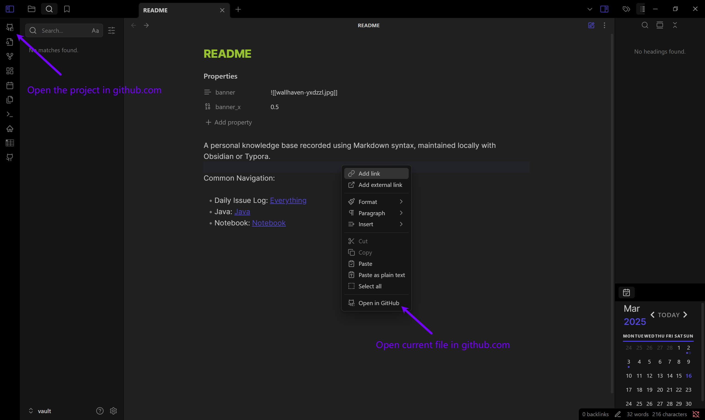
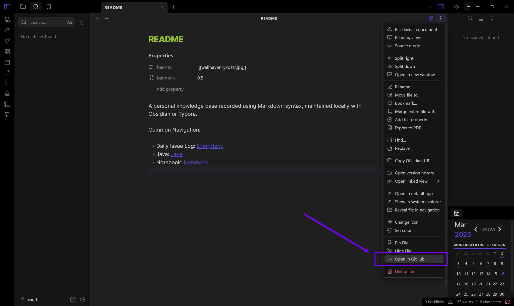

# Open in GitHub Plugin For Obsidian

This is an Obsidian plugin designed to open projects or files directly in GitHub via your browser. Learn more about Obsidian at https://obsidian.md.




## Manually installing the plugin

- Copy over `main.js`,`manifest.json`,`styles.css` to your vault `VaultFolder/.obsidian/plugins/open-in-github`.

## Development

Clone this repo to `VaultFolder/.obsidian/plugins/` and excute the commands below, then open your Obsidian App.
```
pnpm i
pnpm dev
```

Documentation:
- https://docs.obsidian.md
- https://github.com/obsidianmd/obsidian-api
